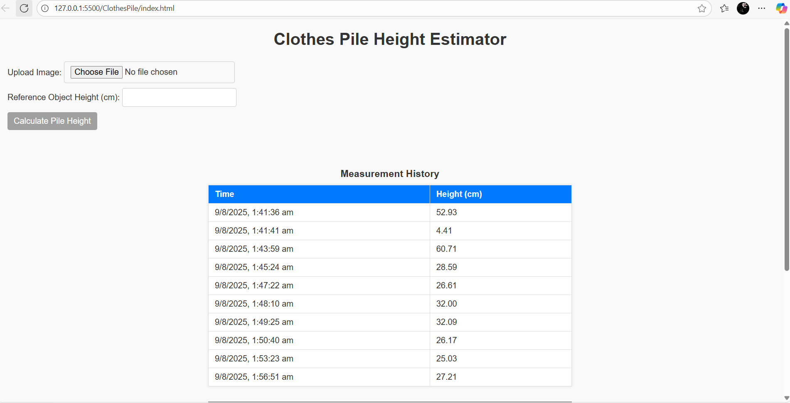
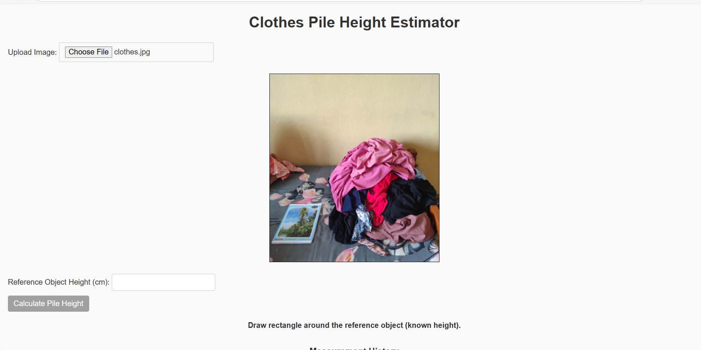
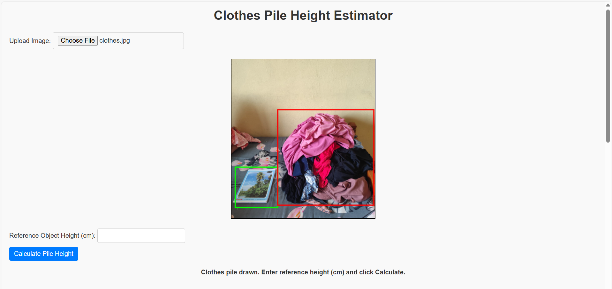
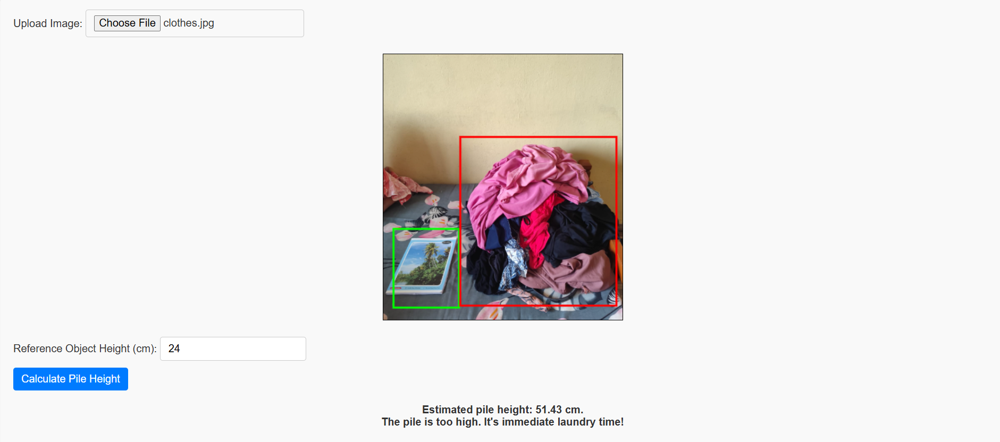
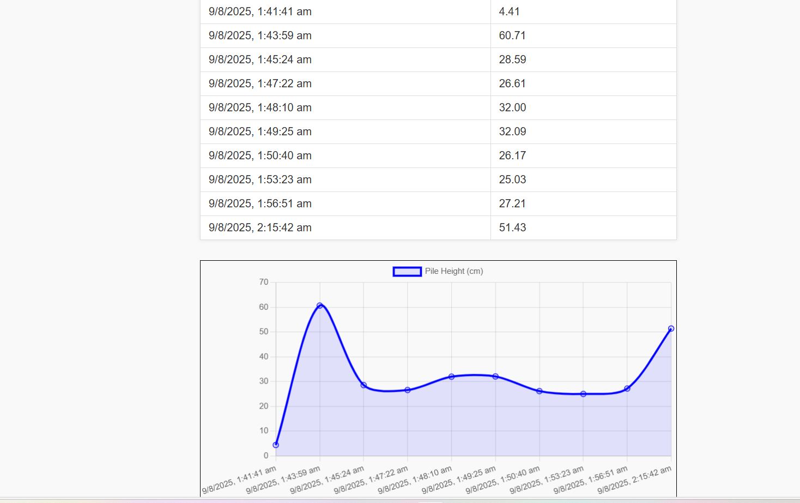
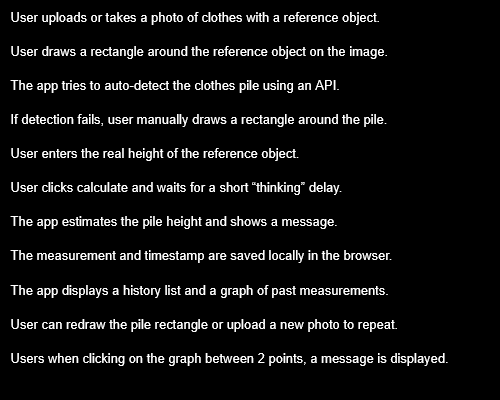

# Clothes Pile Height Detector 🎯

## Basic Details

### Team Members
- Member 1: Anuprabha Babu -Mar Athanasius College of Engineering

### Project Description
This is for people who are too lazy to do their laundry.THey just pile up the clothes. This project is to calculate an estimated height of the pile.

### The Problem (that doesn't exist)
There are lots of clothes to wash, but it can be done be done in a day.

### The Solution (that nobody asked for)
When there is a pile of clothes to wash, who would care to know its height?

## Technical Details
### Technologies/Components Used
For Software:
- Language used:CSS,JS,HTML
- [Frameworks used]
- Chart.js(to display graph)
- VS Code,, LocalStorage API

### Implementation
For Software:
# Installation
This is a simpe web app.No need of installation.

# Run
Just open the link https://clothes-pile-height-estimator.vercel.app/

### Project Documentation
For Software:

# Screenshots (Add at least 3)

This is the first page that comes.Since I already made several measurements, it will be shown.

The image is uploaded. It includes a pile of clothes and a book besides it whose original length is known. 

The reference object is within green rectangle and the clothes pile is in the red rectangle.

On entering the length of referenc eobject, the estimated height of the pile is calculated. It is displayed along with a message. There will be a delay of a few seconds.During this time a message is displayed.

All the earlier measurements are recorded and it is represented in graph format.

# Diagrams

First its the users choice whether to browse image or take photo .The photo should contain a pile of clothes as well as an object next to it whose height is shown.Then the user draws rectangles around the reference object and the pile of clothes.Then onentering the size of the refernce object, the estimated height of the pile is calculated.The measurements are stored and shown in graphical format.

---
Made with ❤️ at TinkerHub Useless Projects 

